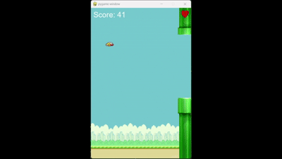

# Simple Flappy Bird with Q-Learning

This project implements a simple Flappy Bird game using Pygame, enhanced with Q-Learning, a type of reinforcement learning. The goal of the agent (the bird) is to learn how to fly through pipes by jumping when necessary. The Q-learning algorithm is used to train the bird to avoid obstacles and increase its score over time.

## Features

- **Pygame-based graphical interface** for rendering the game.
- **Q-Learning agent** that learns how to play the game by observing the environment and adjusting actions accordingly.
- **Dynamic gameplay** where pipes move, and the bird's physics simulate gravity and jumping.
- **Game Over screen** with score.

## Requirements

- Python 3.x
- Pygame
- Numpy

You can install the necessary Python packages using `pip`:

```bash
pip install pygame numpy
````

## How to Run
Clone the repository or download the script to your local machine.
Make sure you have the required images in the same directory as the script:

- background.png
- bird.png
- pipe.png
- heart.png

Run the script using Python:
```bash
python flappy_bird_q_learning.py
```

The game will start, and the agent will begin learning how to play the game using Q-learning. During training, the agent will explore different actions (jump or do nothing), and over time, it will improve its performance.

## Q-Learning 
The Q-Learning agent learns through exploration and exploitation.
It discretizes the state into bins based on the bird's vertical position, the pipe's position, and the gap size.
The agent's actions are:
- 0: Do nothing.
- 1: Jump.

The Q-table is updated after every action, using the formula:
```
Q(state, action) = (1 - LEARNING_RATE) * Q(state, action) + LEARNING_RATE * (reward + DISCOUNT_FACTOR * max(Q(next_state, all_actions)))
```
## Hyperparameters
- Learning Rate (LEARNING_RATE): Controls how much the new Q-value influences the previous one.
- Discount Factor (DISCOUNT_FACTOR): Determines the importance of future rewards.
- Exploration Probability (EXPLORATION_PROB): The probability of exploring a random action instead of exploiting the learned knowledge.
- Exploration Decay (EXPLORATION_DECAY): Decay rate for the exploration probability over episodes.

## Training Phase
The agent goes through n episodes of training, where it learns by interacting with the game environment.
Every 100 episodes, the agent's current score and exploration probability are printed.
Once the agent is trained, the Q-table is saved in a file named q_table.pkl.

## Playing the Game
After training, the agent will start exploiting the learned Q-table. It will make decisions based on its training and attempt to achieve the highest score possible.

## Demo


## Author
Created by Isabelle Bricaud, please indicate if you are re-using the code.
